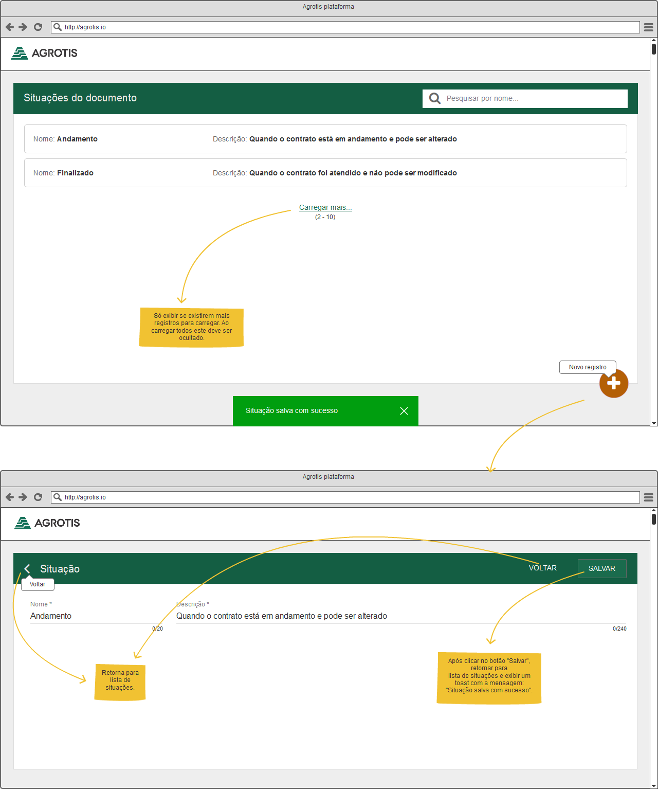

***My response:***
&nbsp;&nbsp;
[**`Run App`**](https://blog.andersonmamede.com.br/challenges-accepted/challenges/agrotis-webapp/app/build/)
&nbsp;&nbsp;
[**`Source Code`**](app/)

> *Companny: [Agrotis](https://www.agrotis.com/)* 
> *Original challenge description: [link](https://github.com/agrotis-io/desafio-front/)* 

## Challenge: Agrotis WebApp

***Stack**: React* 

The idea is simple: you have to develop 2 screens honoring some requirements and the provided layout:

## Requirements
* [ ] React or Angular
* [ ] SVG icons
* [ ] Use Material Design colors
* [ ] README with instructions on how to deploy

## Tips
- [ ] Styled Components
- [ ] Follow Material Design Guidelines
- [ ] React Router

## Bonuses
- [ ] Create issues and solve them using pull requests
- [ ] Small files with just a few responsibilities
- [ ] Redux
- [ ] Good usability
- [ ] Give user feedback while searching/loading
- [ ] Follow a JavaScript Style Guide
- [ ] Responsive layout (be creative!)
