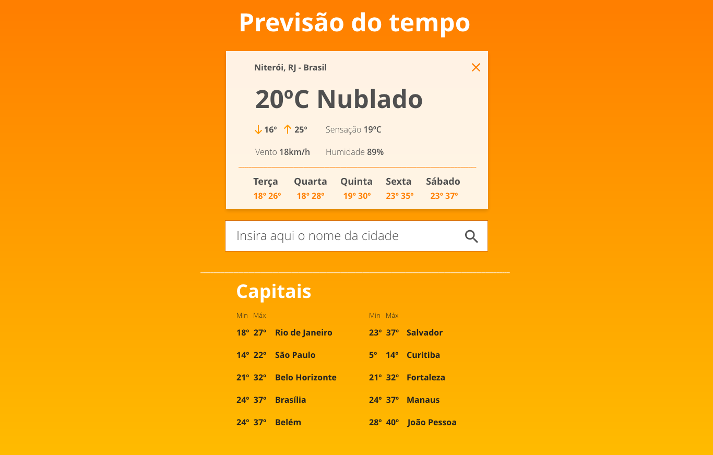
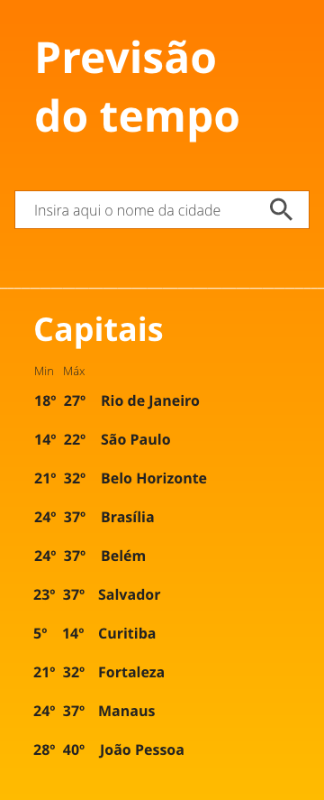

***My response:** [app](app/)*

>  *Companny: [1STi](http://www.1sti.com.br/)* 
> *Original challenge description: [link](https://github.com/1STi/desafio-frontend/)* 

## Challenge: Weather forecast SPA

***Stack**: React* 

Let's take a look at the weather forecast? The goal is to create a SPA (Single Page Application) to consume [Yahoo's weather forecast API](https://developer.yahoo.com/weather/). Layout should be responsive and as close as possible to the images below:

Web:

Mobile:

## Tips

* Alright, you can use jQuery. If you prefer not to use (bonus!), you can use Axios to communicate with the API.
* HTML should be as semantic as possible.
* Readme and deployment instructions are welcomed.
* CSS preprocessors like Stylus or LESS are welcomed too.
* What about using BEM methodology? http://getbem.com/naming/
